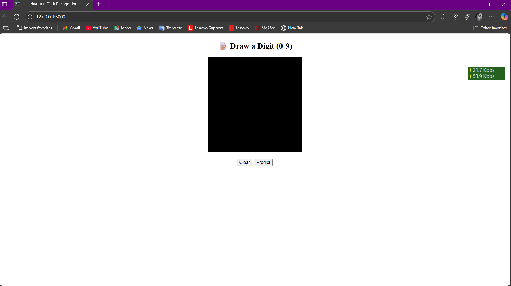
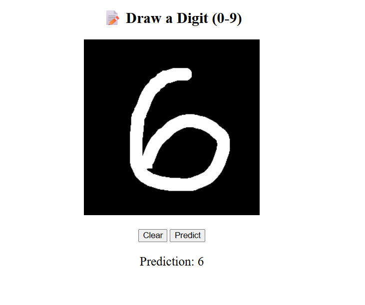
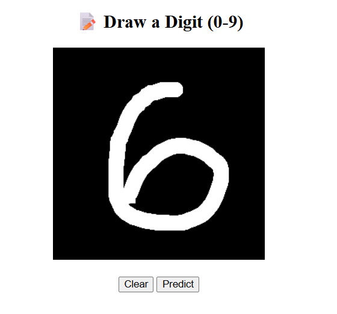

# digit_recognition_app

---

## 📄 requirements.txt

```text
flask
tensorflow
keras
pillow
numpy
```

---

## 📂 Project Structure

```

digit\_recognition\_app/
├── model/
│   └── digit\_recognizer.h5      # trained CNN model
├── app.py                       # Flask web app (all-in-one)
├── train\_model.py               # script to train the model on MNIST
├── requirements.txt             # required Python packages
└── README.md                    # project description and instructions

````

---

## 📌 Features

- 🖌️ Draw digits 0-9 using your mouse on an HTML5 canvas.
- 🔮 Real-time prediction using a trained CNN model.
- 🖥️ Clean Flask web app with a single `app.py` (no external HTML files).
- 📚 MNIST dataset used for training.
- 🎨 Browser-based canvas interface.

---

## 📊 Model Architecture

- **Conv2D (32 filters, 3×3, ReLU)**
- **MaxPooling2D (2×2)**
- **Conv2D (64 filters, 3×3, ReLU)**
- **MaxPooling2D (2×2)**
- **Flatten**
- **Dense (128, ReLU)**
- **Dense (10, Softmax)**

---

## 📥 Installation & Setup

1️⃣ **Clone this repository**

```bash
git clone https://github.com/yaswanthKumar44/digit_recognition_app.git
cd digit_recognition_app
````

2️⃣ **Install dependencies**

```bash
pip install -r requirements.txt
```

3️⃣ **Train the model (optional — already included)**

```bash
python train_model.py
```

This will save `model/digit_recognizer.h5`.

4️⃣ **Run the Flask app**

```bash
python app.py
```

5️⃣ **Open your browser**

Visit: [http://127.0.0.1:5000/](http://127.0.0.1:5000/)

---

## 🎨 How it Works

* Draw a digit (0-9) on the canvas.
* Press `Predict`.
* The canvas data is converted to a base64 PNG image.
* Flask decodes and preprocesses the image to match MNIST format.
* The trained model predicts the digit.
* Result is displayed instantly below the canvas.

---

## 📷 Screenshots

### 📍 Web Interface (Home)



### 📍 Drawing a Digit



### 📍 Prediction Result



---

## 📈 Result

| Metric        | Value    |
| :------------ | :------- |
| Test Accuracy | \~99.00% |
| Dataset       | MNIST    |

---

## 📜 License

This project is open-source and free to use.

---

## 👤 Author

* [P. Yaswanth Kumar](https://github.com/yaswanthKumar44)

---

## ⭐ Acknowledgements

* TensorFlow / Keras
* Flask
* MNIST Dataset (Yann LeCun)

---

## 📣 Support

Leave a ⭐ if you like the project!

  
